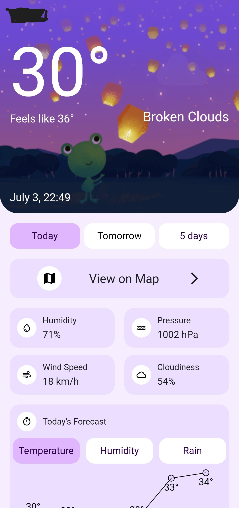
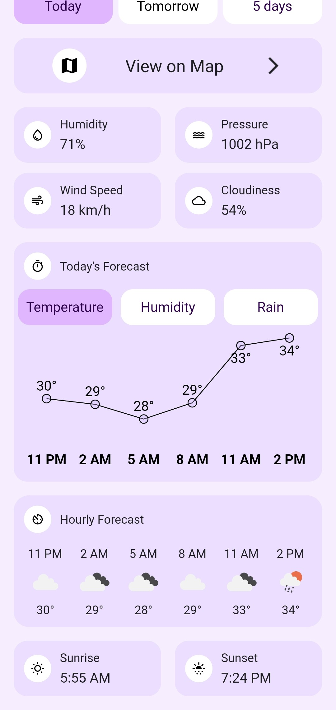
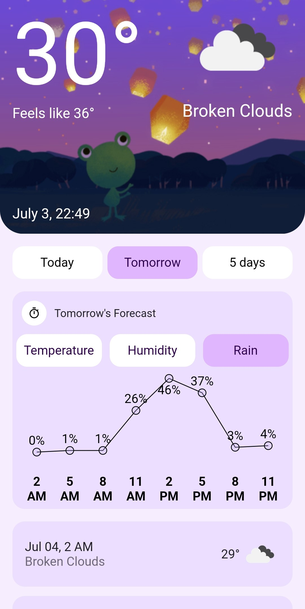
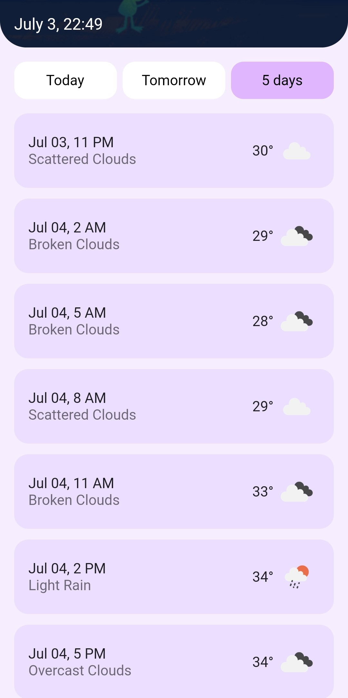
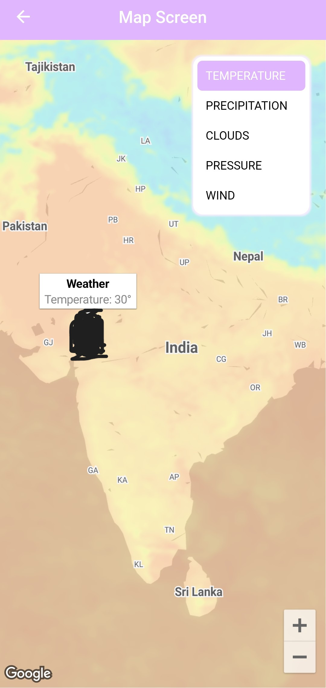
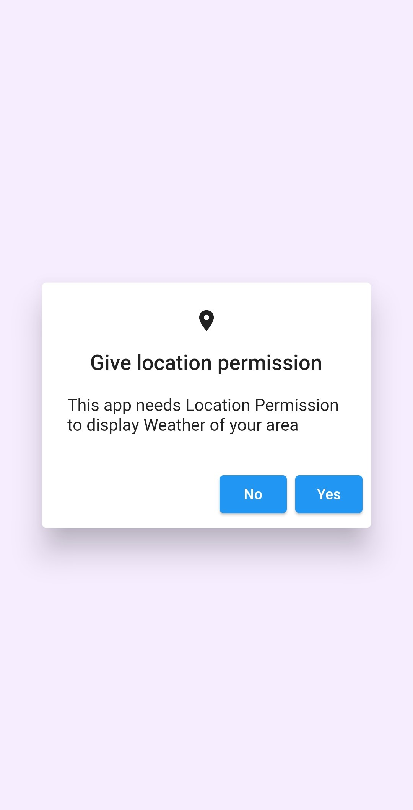

# Weather App

This is a Weather App built using Flutter. This example app utilizes the Domain-Driven Design (DDD) architectural pattern for organizing the codebase and follows the best practices for scalable projects.

## Features

- See live Weather of your area
- View metrics like Temperature, Humidity, Rain probability as Line Chart
- View hourly, daily and 5 day forecast
- View Weather metrics on Map overlay

## Getting Started

To get started with the Weather app, follow the steps below:

### 1. Clone the repository:

```shell
   git clone https://github.com/Yavnik/weather_app.git
```

### 2. API Keys

  Before running the code, you need to enter your API keys in the `.env` file. This file is used to store sensitive information, such as API keys, in a secure manner. To set up the API keys, follow the instructions below:

  1. Rename the `example.env` file to `.env`. This file is located in the root directory of the project.
  2. Open the `.env` file in a text editor.

  ### OpenWeatherMap API Key

To retrieve the OpenWeatherMap API key, follow these steps:

1. Visit the [OpenWeatherMap website](https://openweathermap.org/) and create an account.
2. After logging in, navigate to the API Keys section.
3. Generate a new API key for your Weather app.
4. Copy the generated API key.
5. In the `.env` file, find the line that says `OPEN_WEATHER_MAP_API_KEY=` and paste your API key after the equals sign.

Example: OPEN_WEATHER_MAP_API_KEY=your_openweathermap_api_key

  
### Google Maps API Key

To obtain the Google Maps API key, follow these steps:

1. Go to the [Google Cloud Console](https://console.cloud.google.com/).
2. Choose the project that you want to enable Google Maps on.
3. Select the navigation menu and then select "Google Maps".
4. Select "APIs" under the Google Maps menu.
5. To enable Google Maps for Android, select "Maps SDK for Android" in the "Additional APIs" section, then select "ENABLE".
5. Copy the generated API key.
6. In the `.env` file, find the line that says `GOOGLE_MAPS_API_KEY=` and paste your API key after the equals sign.

Example: GOOGLE_MAPS_API_KEY=your_google_maps_api_key


Please note that it's important to keep your API keys secure and avoid sharing them publicly. Ensure that the `.env` file is included in your `.gitignore` file to prevent accidental uploads to version control.

### 3. Run
  Run the following commands
```shell
   flutter pub get
   flutter pub run build_runner build --delete-conflicting-outputs
   flutter run
```
  To run the tests
```shell
   flutter test
```


## Architecture

### Domain Driven Design

Domain Driven Design (DDD) has been used extensively in this app. DDD is a software development methodology that focuses on the problem domain and the business logic of the application. It aims to create software that is easy to understand, maintain and extend.
The benefits of using DDD include:

- Clear separation of concerns between the presentation (UI Layer), application logic and data storage.
- Improves collaboration between developers and domain experts.
- Increased code quality and extensibility.
- Makes scaling the app easier and efficient in adding new features.

This app is divided into four layers:

### Application Layer

The Application layer contains the app's business logic, implemented using BLoC (Business Logic Component) architecture. BLoCs are responsible for managing the app's state and handling events from the Presentation layer. The Application layer interacts with the Domain and Infrastructure layers to retrieve and process weather data.

### Domain Layer

The Domain layer defines the core business logic and entities of the app. It contains repositories and failure classes related to the app's domain entities. For example, the Weather domain has a WeatherRepository interface and a WeatherFailure class. The repositories define methods to fetch weather data, while the failure classes represent specific error scenarios related to the weather domain.

### Infrastructure Layer

The Infrastructure layer is responsible for implementing the repositories defined in the Domain layer. It interacts with external services, such as the OpenWeatherMap API, to fetch weather data. The Infrastructure layer handles the conversion of raw JSON responses to domain objects using Data Transfer Objects (DTOs). This layer also ensures that the Domain layer remains agnostic to the data source.

### Presentation Layer

The Presentation layer handles the user interface and user interaction. It consists of various screens and widgets that are responsible for displaying weather data to the user and handling user inputs. The Presentation layer consumes BLoC states to update the UI and triggers BLoC events in response to user actions.

## State Management

The Weather app utilizes the Bloc library for state management. BLoCs receive events from the Presentation layer and fetch data from the repositories in the Infrastructure layer. The fetched data is then sent back to the Presentation layer as states. Bloc events and states are built using the freezed library, which simplifies the creation of immutable event and state classes through factory constructors.

## Project Structure

The project structure follows a modular organization to separate concerns and improve maintainability. Here's an overview of the directory structure:

```shell
lib/
    - application/
      - location_bloc/ # Responsible for checking and getting Location Permissions
      - map_bloc/ # Responsible for providing TileOverlays for map
      - weather_bloc/ # Responsible for fetching weather and providing to UI.

    - domain/
      - location/
        - i_location_repository.dart # Absraction for getLocation() method
        - location_failure.dart # Describes types of failures
      - map/
        - i_map_repository.dart
        - map_failure.dart # Describes types of failures
      - weather/
        - i_weather_repository.dart
        - weather_failure.dart
        - weather.dart # Describes types of failures

    - infrastructure/
      - location/
        - location_repository.dart # Implements `i_location_repository`
      - map/
        - map_dto.dart # Converts domain values to API specific values
        - map_repository.dart # Fetches TileOverlays from API
      - weather/
        - weather_dto.dart # Converts raw json to objects of Weather class
        - weather_repository.dart # Fetches current and forecase conditions from API

    - presentation/
      - home_screen/ # This basically exists just to get Location permission
      - map_screen/
      - weather_screen/

    - main.dart
```
## Screenshots

UI Inspiration from the work done by awesome designer Danyil Kobzar (https://www.figma.com/community/file/1249443729401540968/Google-Weather-App-Redesign).

<p float="middle">
  
   
  
</p>
<p float="middle">
  
   
  
</p>

## Contributing

Contributions are welcome and much appreciated. Please fork the repository and submit a pull request with your changes.

Here are some potential areas of improvement and future enhancements for the Weather app:

- **Internet Connectivity**: Implement a mechanism to check for internet connectivity and provide appropriate feedback to the user when the internet is not available. This can help prevent errors or incomplete data fetching.

- **Testing**: Enhance the test coverage of the app by writing unit tests for critical components such as BLoCs, repositories, and domain entities. This ensures the stability and reliability of the app's functionality.

- **Error Handling**: Improve the error handling mechanism by providing more detailed error messages or user-friendly error notifications/snackbars to users. All necesarry Failure classes have been created already, just need to display them appropriately in UI.

- **UI/UX Enhancements**: Continuously improve the app's user interface and user experience based on user feedback. Some current issues are in Line Chart where labels sometimes overlap with lines.